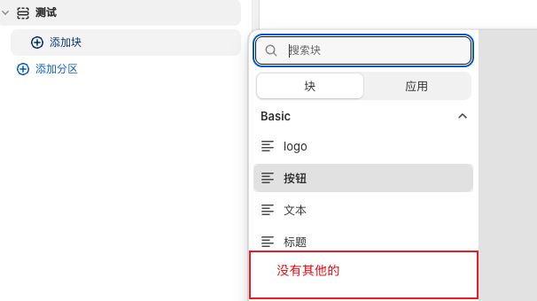
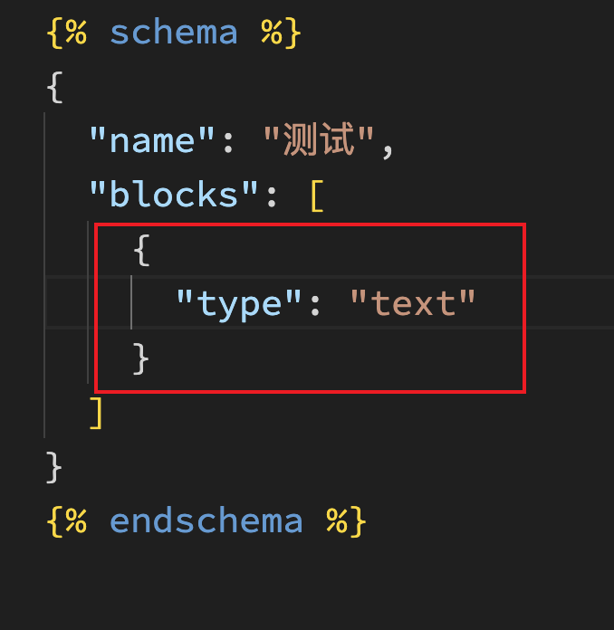

## 006 控制块是否出现在选择器内

|本期版本|上期版本
|:---:|:---:
`Sun Sep 14 16:52:15 CST 2025` | -


## Accept all theme blocks

```ruby
"blocks": [{"type": "@theme"}]
```


## Accept specific theme blocks

```ruby
"blocks": [{"type": "slide"}]
```


> 来自 ChartGPT

* Shopify 会去 **/blocks/slide.liquid**
* type 必须和 blocks/ 下的文件名一致。







## Private blocks


* 使用下划线开头